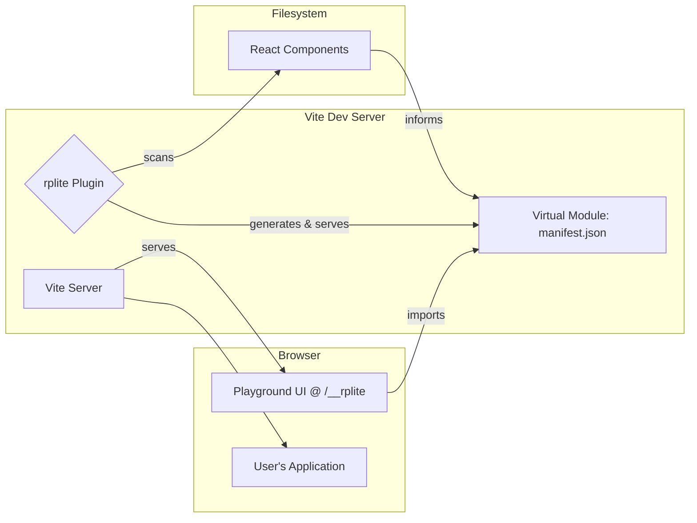

# React Playground Lite (`rplite`)

<p align="center">
  <strong>A zero-config, Vite-first React component playground.</strong>
  <br />
  `rplite` finds your components, infers controls for their props, and serves a fast, clean UI to preview them. No story files needed.
</p>

## Why `rplite`?

`rplite` is designed for developers who want a simple, fast, and unobtrusive way to visualize their React components. If you're building a component library or just want to work on components in isolation, `rplite` provides the essentials without the boilerplate.

- **For Component-Driven Development**: Work on one component at a time, see its different states, and share your work with your team.
- **For Design Systems**: `rplite` can serve as a lightweight, living documentation for your design system's components.
- **For Rapid Prototyping**: Quickly iterate on component design and functionality in a clean, isolated environment.

## Features

- **🚀 Zero-Configuration**: Drop it into your Vite-powered React project and it just works.
- **🔍 Automatic Component Discovery**: Finds your exported React components with no extra story files.
- **✨ Prop Control Inference**: Infers controls for primitives, string unions, string-valued enums, and single-level arrays.
- **🛡️ Versioned Manifest**: The plugin/runtime share a schema-versioned manifest that is validated at runtime before rendering.
- **🧭 Configurable Scanning**: Ignore noisy paths with glob patterns and hook into structured logger callbacks for diagnostics.
- **⚡ Fast Development**: Integrates seamlessly with Vite's dev server and Hot Module Replacement (HMR).

## Quick Start

### 1. Installation

This project is not yet published to npm. To use it, you can clone the repository and use it locally.

```bash
# Clone the repository
git clone https://github.com/your-username/rplite.git
cd rplite

# Install dependencies using Yarn workspaces
yarn install
```

### 2. Vite Configuration

In your own Vite project, you would add `@rplite/plugin`. For this example project, the plugin is already configured in `example/vite.config.ts`.

```typescript
// example/vite.config.ts
import { defineConfig } from 'vite';
import react from '@vitejs/plugin-react';
import rplite from '@rplite/plugin';

export default defineConfig({
  plugins: [
    react(),
    rplite({
      // optional: configure ignore globs or logger hooks here
    }),
  ],
});
```

> **Tip:** When developing inside this repository, run `yarn build` once to emit the plugin and runtime `dist/` directories before bundling or running the example app.

### 3. Run the Dev Server

Start the example's Vite development server.

```bash
yarn dev
```

### 4. Open the Playground

Navigate to `http://localhost:5173/__rplite` (or whatever port Vite is using) to see your component playground!

### 5. Validate Your Changes

Run the automated checks before opening a pull request or trying the example app in production mode:

```bash
yarn test       # Vitest suite for plugin + runtime
yarn typecheck  # Project references type-check
yarn build      # Emits dist/ artifacts for plugin and runtime
```

## How It Works

`rplite`'s architecture is simple and leverages the power of Vite's development server.



1.  **Plugin Initialization**: The `@rplite/plugin` is added to your Vite config.
2.  **Component Scanning**: On startup, the plugin scans your source code (`src` by default) for React components. It uses the TypeScript compiler to understand your code and extract information about each component and its props.
3.  **Manifest Generation**: The plugin creates a virtual JSON file (the "manifest") in memory that lists all the found components.
4.  **Serving the UI**: The plugin tells the Vite server to serve the `@rplite/runtime` application at the `/__rplite` URL.
5.  **Fetching the Manifest**: The runtime UI fetches the component manifest from the virtual module to know what to display.
6.  **Rendering**: The UI lists the components and, when one is selected, renders it in an `iframe` with controls for its props.

For more technical details, see the README files in the `@rplite/plugin` and `@rplite/runtime` packages.

## Comparison with Other Tools

| Feature                  | `rplite`                                  | Storybook                                  |
| ------------------------ | ----------------------------------------- | ------------------------------------------ |
| **Setup**                | Zero-config, single plugin                | More complex setup, many packages          |
| **"Stories"**            | Not required, components are discovered   | Requires `.stories.js` files for each component |
| **Speed**                | Very fast, built on Vite                  | Can be slower, especially on large projects |
| **Features**             | Focused on component previewing           | Extremely feature-rich (addons, testing, etc.) |
| **Best For**             | Quick, simple component visualization     | Comprehensive design system documentation  |

## Limitations

- Inference currently covers primitives, string-based enums/unions, and single-level arrays. Nested shapes and complex generics are out of scope for now.
- Components must accept a single `props` parameter to be detected.
- The runtime does not yet provide theming, layout presets, or saved scenarios.

## Roadmap

See [`PROJECT_PLAN.md`](./PROJECT_PLAN.md) for the active multi-phase roadmap. Highlights include:

- Hardening the scanner (watching, richer inference, diagnostics).
- Polishing the playground UX with search, theming, and accessibility improvements.
- Establishing CI, release tooling, and documentation workflows.
- Building a showcase example app with reusable scenarios.
