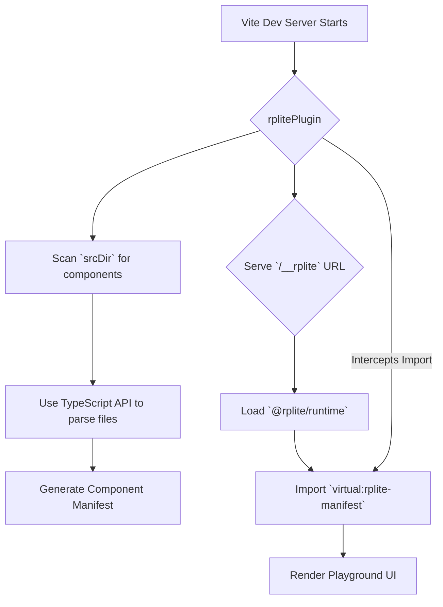

# `@rplite/plugin`

This package contains the core Vite plugin for `rplite` (React Playground Lite). It is responsible for discovering components, generating the component manifest, and serving the playground UI.

## How it Works

The plugin integrates into the Vite build process to provide a seamless development experience. Its operation can be broken down into a few key areas:

### 1. Component Scanning (`scanner.ts`)

The heart of the plugin is the component scanner. When Vite starts, the plugin recursively scans the specified `srcDir` for `.ts` and `.tsx` files. For each file, it uses the **TypeScript Compiler API** to parse the source code into an Abstract Syntax Tree (AST).

By traversing the AST, the scanner can:
- Identify all `export` statements.
- Determine if an export is a React component (currently, it assumes exported functions that take a single `props` object are components).
- Analyze the `props` type definition to infer prop types (`string`, `number`, `boolean`, unions of string literals, enums, and one-dimensional arrays of those shapes).

This process is what allows `rplite` to be zero-config. It understands your components by reading the code directly, not by requiring you to write special "story" files.

### 2. Manifest Generation (Virtual Module)

Once the scanner has a list of components and their props, it generates a **manifest**. This manifest is a JSON object that describes all the discovered components.

To make this manifest available to the playground runtime, the plugin creates a **Vite virtual module**. The module is named `virtual:rplite-manifest`. When the runtime application (which runs in the browser) tries to import from this module, our plugin intercepts the request and returns the generated JSON manifest as a JavaScript module.

### 3. Playground Server

The plugin sets up a middleware in the Vite development server that listens for requests to the `/__rplite` path. When you navigate to this URL, the plugin serves a simple HTML file that acts as a host for the `@rplite/runtime` React application.

### Workflow Diagram



## API Reference

### `rplitePlugin(options)`

This is the main function you use in your `vite.config.ts`.

#### `options`

An object with the following properties:

| Option    | Type              | Default | Description                                                                                 |
| :-------- | :---------------- | :------ | :------------------------------------------------------------------------------------------ |
| `srcDir`  | `string`          | `'src'` | Directory to scan for components, relative to the project root.                             |
| `ignore`  | `string[]`        | `[]`    | Additional glob patterns (relative to the project root) to exclude from component scanning. |
| `logger`  | `ScannerLogger`   | `null`  | Optional logger implementing `info`, `warn`, or `error` for scanner diagnostics.            |

`ScannerLogger` is a lightweight interface with optional `info`, `warn`, and `error` methods. Each method receives a message identifier such as `rplite:scanner:ignored` and a context payload describing what happened during scanning.

**Example:**
```typescript
// vite.config.ts
import { defineConfig } from 'vite';
import react from '@vitejs/plugin-react';
import rplite from '@rplite/plugin';

export default defineConfig({
  plugins: [
    react(),
    // Configure rplite to only scan the `src/components` directory
    rplite({
      srcDir: 'src/components',
      ignore: ['**/*.stories.tsx'],
      logger: {
        info(message, context) {
          if (message === 'rplite:scanner:ignored') {
            console.log('[rplite] ignored', context?.path);
          }
        },
      },
    }),
  ],
});
```

### Manifest versioning & types

The plugin exports a `MANIFEST_VERSION` constant and the manifest type definitions via `@rplite/plugin/manifest`. The runtime validates the manifest against this version before rendering, so bump the version whenever you introduce breaking schema changes.

```ts
import { MANIFEST_VERSION, type Manifest } from '@rplite/plugin/manifest';

console.log(`Emitting manifest version ${MANIFEST_VERSION}`);
```

### Logging & diagnostics

Pass a `logger` object to surface scanner events (ignored paths, file read failures, or scan errors) in your preferred logging layer. Each log includes a message identifier and a context payload detailing the event. When no logger is supplied, the plugin defers to Vite's logger in dev mode and falls back to `console` during builds.

```ts
rplite({
  logger: {
    warn(message, context) {
      if (message === 'rplite:scanner:scan-error') {
        console.warn('[rplite] Failed to scan', context?.path, context?.error);
      }
    },
  },
});
```

#### Default ignore patterns

The scanner skips common non-source files and directories by default:

- `**/node_modules/**`
- `**/dist/**`, `**/build/**`, `**/.vite/**`, `**/.next/**`
- `**/.storybook/**`, `**/storybook-static/**`, `**/coverage/**`
- `**/*.test.*`, `**/*.spec.*`, `**/*.stories.*`

You can extend or override this with the `ignore` option. When a user-specified pattern causes a file to be skipped, the scanner emits an `info` log with `rplite:scanner:ignored` and the matched pattern.

#### Unsupported prop warnings

If a component prop cannot be inferred to a supported control type (primitives, string unions, enums, or arrays of those), the scanner emits a `warn` log with `rplite:scanner:unsupported-prop` including the component, prop name, and the TypeScript type string. This helps explain why a given control is missing in the playground without failing the scan.

## Troubleshooting

### No components are appearing in the playground.

- **Check `srcDir`**: Ensure the `srcDir` option in your `vite.config.ts` points to the correct directory where your components are located.
- **Exported Components**: `rplite` only discovers exported React components. Make sure your components are properly exported (e.g., `export default function MyComponent...` or `export const MyComponent = ...`).
- **Props Requirement**: The scanner currently only identifies functions as components if they accept a `props` object. Components with no props may not be discovered. This is a known limitation.

### The playground UI is not loading.

- **Vite Server**: Make sure your Vite development server is running.
- **URL**: Double-check that you are navigating to the correct URL, which is `http://<your-dev-server>/__rplite`.
- **Plugin Order**: While unlikely to cause issues, ensure `rplite()` is placed after `react()` in your Vite plugins array.
