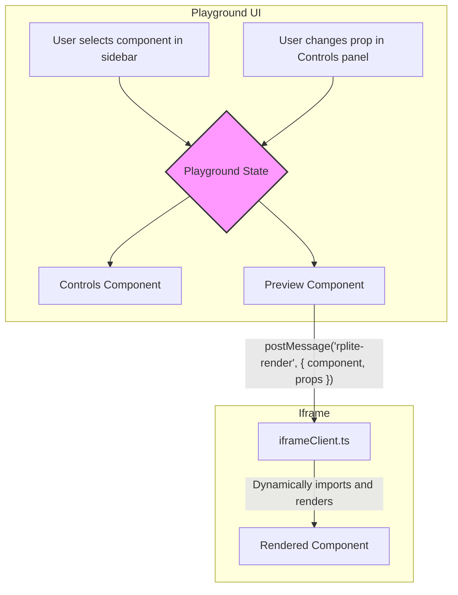

# `@rplite/runtime`

This package contains the React application that powers the UI for `rplite` (React Playground Lite).

## How it Works

The runtime is a self-contained React application served by `@rplite/plugin`. It is responsible for the entire user-facing experience of the playground.

### Core Components

The UI is built from a few key components:

- **`Playground`**: The main component that orchestrates the entire UI. It manages the state, including the list of components, the currently selected component, and its prop values.
- **`Controls`**: This component receives the definition for the selected component and dynamically renders a form with the appropriate input controls for each prop (e.g., a text input for `string` props, a checkbox for `boolean` props).
- **`Preview`**: This component is responsible for rendering the selected component in an isolated environment.

### The `iframe` Architecture

To prevent style collisions and provide a clean preview environment, the `Preview` component renders the target component inside an `<iframe>`. This is a critical architectural choice that ensures what you see in the playground is as close as possible to how the component would look in a real application.

Communication between the main playground UI and the `iframe` is handled using the `window.postMessage` API.

1.  **Initialization**: The `Preview` component renders an `iframe` with a simple HTML document. This document includes the `iframeClient.ts` script.
2.  **Ready Signal**: Once the `iframeClient.ts` script is loaded, it sends a `rplite-iframe-ready` message to the parent window.
3.  **Render Message**: When the `Preview` component receives the "ready" signal, it sends a `rplite-render` message to the `iframe`. This message contains the component's definition and the current prop values.
4.  **Dynamic Import**: The `iframeClient.ts` script receives the render message, dynamically imports the target component's module using `import()`, and renders it into the `iframe`'s body.
5.  **Prop Updates**: When a prop is changed in the `Controls` panel, the `Playground` component's state is updated, which triggers a re-render of the `Preview` component, sending a new `rplite-render` message to the `iframe`.
6.  **Unmount**: When a new component is selected, a `rplite-unmount` message is sent first to clean up the old component before the new one is rendered.

### Data Flow Diagram

This diagram illustrates how data flows from the user's actions to the final rendered component.

This architecture ensures that the playground UI and the component being previewed are completely decoupled, providing stability and accurate previews.
